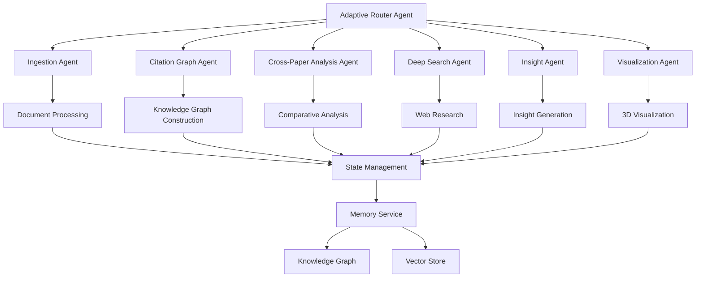
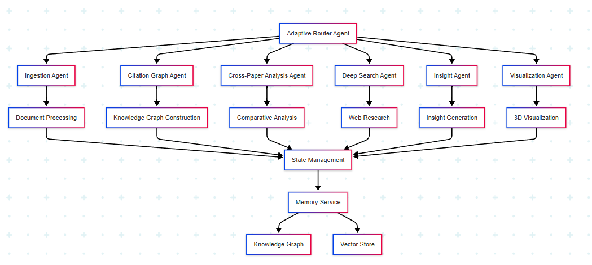
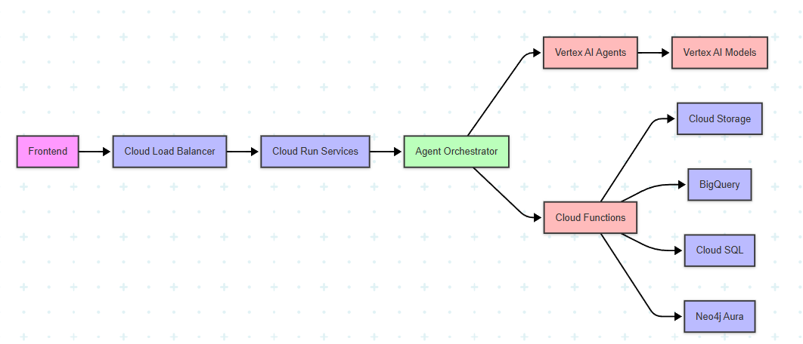

# ScholarVerse: Autonomous Scientific Knowledge Graph Platform

## Overview

ScholarVerse is an advanced knowledge graph platform for scientific literature that leverages Google's Agent Development Kit (ADK) to orchestrate autonomous intelligent agents for processing, analyzing, and visualizing scientific papers. The platform ingests scientific papers, extracts key information, builds a knowledge graph of citations and relationships, generates insights, performs real-time deep search for related concepts, conducts cross-paper analysis, and visualizes the connections in an interactive 3D environment.

## Key Features

- **Autonomous Multi-Agent Architecture**: Utilizes Google's Agent Development Kit (ADK) to coordinate self-directed, adaptive agents that make decisions based on context and feedback
- **Intelligent Document Processing**: Extracts text, metadata, and citations from scientific papers
- **Advanced Knowledge Graph Construction**: Builds a comprehensive graph of papers, authors, citations with deep interlinking of methodologies, findings, and concepts
- **Cross-Paper Analysis**: Performs comparative analysis across multiple papers to identify similarities, differences, and trends in methodologies and findings
- **Real-Time Deep Search**: Provides LLM-powered web scraping to find additional information about concepts, methodologies, and authors mentioned in papers
- **AI-Powered Insights**: Generates summaries, trend analyses, and comparative analyses using Google Gemini
- **Interactive 3D Visualization**: Visualizes the knowledge graph in an immersive 3D environment with concept clustering and relationship highlighting

## System Architecture

ScholarVerse is built on a multi-agent architecture using Google's Agent Development Kit (ADK), with the following components:

### 1. Autonomous Agent System

- **Adaptive Router Agent**: Dynamically coordinates workflows between agents based on content analysis, user needs, and agent feedback (inspired by Data Science Agent's root agent architecture)
- **Ingestion Agent**: Processes PDF documents and extracts text and metadata with self-improving extraction capabilities (inspired by FOMC Research Agent's extract_page_data_agent)
- **Citation Graph Agent**: Constructs and maintains the knowledge graph in Neo4j, autonomously identifying complex relationships between papers (using NL2SQL capabilities from Data Science Agent)
- **Cross-Paper Analysis Agent**: Performs deep comparative analysis across multiple papers to identify methodological patterns, conflicting findings, and research trends (using comparison tools from FOMC Research Agent)
- **Deep Search Agent**: Conducts real-time web scraping to find additional information about concepts, methodologies, and authors mentioned in papers (leveraging RAG Agent's retrieval capabilities)
- **Insight Agent**: Generates AI-powered insights using Google Gemini with iterative refinement based on feedback (implementing LLM Auditor's critic/reviser pattern)
- **Visualization Agent**: Prepares data for 3D visualization with intelligent clustering and highlighting of important relationships (using Data Science Agent's visualization capabilities)

### 2. Technology Stack

- **Backend**: Python, FastAPI, Google ADK
- **Database**: Neo4j (graph database), Redis (caching), Qdrant (vector search), BigQuery (for analytics)
- **AI/ML**: Google Gemini API, Document AI, Vertex AI RAG Engine
- **Agent Tools**: Web search, NL2SQL, Code Interpreter, Vertex AI Search
- **Evaluation Framework**: ADK AgentEvaluator for quality assessment
- **Frontend**: React, Three.js for 3D visualization
- **Cloud**: Google Cloud (GCS, Vertex AI, BigQuery)
- **Deployment**: Vertex AI Agent Engine

## Google ADK Integration

ScholarVerse leverages Google's Agent Development Kit (ADK) to create a powerful, scalable, and maintainable multi-agent system. The ADK provides robust tools for agent orchestration, state management, and memory handling.

### Core ADK Components

1. **Session Management**
   - **SessionService**: Central manager for conversation threads
     - `InMemorySessionService`: For development and testing
     - `VertexAiSessionService`: For production deployment on Google Cloud
     - `DatabaseSessionService`: For custom database persistence
   - **Session State**: Contextual storage with multiple scopes
     - Session-specific state (temporary)
     - User state (persists across sessions)
     - Application state (global)
     - Temporary state (single turn)

2. **Memory Management**
   - **MemoryService**: Long-term knowledge storage and retrieval
     - `InMemoryMemoryService`: For development
     - `VertexAiRagMemoryService`: For production with semantic search
   - **Knowledge Graph Integration**: Seamless connection with Neo4j for structured knowledge

3. **State Management**
   - Hierarchical state management with automatic persistence
   - State delta tracking for efficient updates
   - Thread-safe state operations

4. **Evaluation Framework**
   - Built-in tools for agent performance evaluation
   - Support for both unit tests and complex scenario testing
   - Integration with ADK's telemetry for monitoring

### Enhanced Agent Architecture

ScholarVerse implements a sophisticated agent architecture using ADK's capabilities:



### State Management Implementation

ScholarVerse implements a sophisticated state management system using ADK's capabilities:

1. **Session State**
   ```python
   # Example: Storing and retrieving session state
   async def process_document(session, document):
       # Store document processing state
       await session.state.update({
           'current_document': document.id,
           'processing_stage': 'extraction',
           'extracted_entities': []
       })
       
       # Process document...
       
       # Update state
       await session.state.update({
           'processing_stage': 'analysis',
           'extracted_entities': entities
       })
   ```

2. **User Preferences**
   ```python
   # Store user preferences
   async def update_user_preferences(user_id, preferences):
       session = await session_service.get_session(
           app_name="scholarverse",
           user_id=user_id,
           session_id=f"prefs_{user_id}"
       )
       await session.state.update({
           'user:preferences': preferences
       })
   ```

3. **Application State**
   ```python
   # Store application-wide settings
   async def update_app_settings(settings):
       session = await session_service.get_session(
           app_name="scholarverse",
           user_id="system",
           session_id="app_settings"
       )
       await session.state.update({
           'app:settings': settings
       })
   ```

### Memory Management Implementation

ScholarVerse utilizes ADK's memory capabilities for long-term knowledge retention:

1. **Knowledge Ingestion**
   ```python
   async def add_to_knowledge_base(session, content):
       # Add processed content to memory
       memory_service = VertexAiRagMemoryService(
           rag_corpus=RAG_CORPUS_RESOURCE_NAME,
           similarity_top_k=5
       )
       
       # Add session to memory with metadata
       await memory_service.add_session_to_memory(
           session,
           metadata={
               'content_type': 'research_paper',
               'domain': 'artificial_intelligence',
               'processing_date': datetime.utcnow().isoformat()
           }
       )
   ```

2. **Semantic Search**
   ```python
   async def search_knowledge(query, user_id, top_k=3):
       # Search across all user's sessions
       results = await memory_service.search_memory(
           app_name="scholarverse",
           user_id=user_id,
           query=query,
           top_k=top_k
       )
       
       # Process and return relevant results
       return [{
           'content': r.content,
           'metadata': r.metadata,
           'score': r.score
       } for r in results]
   ```

### Enhanced Agent Implementation

Each agent in ScholarVerse is implemented as a specialized ADK agent with specific capabilities:

1. **Base Agent Configuration**
   ```python
   from google.adk.agents import LlmAgent
   from google.adk.tools import FunctionTool
   
   class ResearchAgent(LlmAgent):
       def __init__(self, name, description, tools=None):
           super().__init__(
               name=name,
               description=description,
               model="gemini-1.5-pro",
               tools=tools or [],
               state_schema={
                   'type': 'object',
                   'properties': {
                       'research_goals': {'type': 'array', 'items': {'type': 'string'}},
                       'findings': {'type': 'array', 'items': {'type': 'string'}},
                       'citations': {'type': 'array', 'items': {'type': 'string'}}
                   }
               }
           )
   ```

2. **Tool Integration**
   ```python
   # Example tool for web search
   @FunctionTool
   async def web_search(query: str, max_results: int = 5) -> List[Dict]:
       """Search the web for information."""
       # Implementation using ADK's built-in tools
       search_results = await adk_tools.web_search(query, max_results)
       return [{
           'title': r.title,
           'url': r.url,
           'snippet': r.snippet
       } for r in search_results]
   
   # Register tool with agent
   research_agent = ResearchAgent(
       name="research_agent",
       description="Agent for conducting research",
       tools=[web_search]
   )
   ```

3. **State-Aware Processing**
   ```python
   async def process_research_task(agent, task_description, user_id):
       # Create or retrieve session
       session = await session_service.create_session(
           app_name="scholarverse",
           user_id=user_id,
           session_id=f"research_{int(time.time())}"
       )
       
       # Initialize state
       await session.state.update({
           'task_description': task_description,
           'research_goals': [],
           'findings': [],
           'citations': [],
           'status': 'in_progress'
       })
       
       try:
           # Process task using agent
           async for event in agent.run_async(task_description, session=session):
               # Handle different event types
               if event.type == 'tool_call':
                   print(f"Tool called: {event.tool_name}")
               elif event.type == 'response':
                   print(f"Agent response: {event.content}")
                   
                   # Update state based on response
                   if 'findings' in event.content:
                       await session.state.update({
                           'findings': event.content['findings'],
                           'status': 'completed'
                       })
       
       except Exception as e:
           await session.state.update({
               'status': 'error',
               'error': str(e)
           })
           raise
       
       return session.state
   ```

### Evaluation and Monitoring

ScholarVerse includes comprehensive evaluation capabilities:

1. **Test Framework**
   ```python
   from google.adk.evaluation import AgentEvaluator
   
   # Define test cases
   test_cases = [
       {
           'input': 'Find recent papers about transformers in NLP',
           'expected_actions': [
               {'type': 'tool_call', 'tool': 'web_search'},
               {'type': 'response', 'contains': 'transformer architecture'}
           ]
       },
       # More test cases...
   ]
   
   # Run evaluation
   evaluator = AgentEvaluator(agent=research_agent)
   results = await evaluator.run_tests(test_cases)
   ```

2. **Performance Monitoring**
   ```python
   from google.adk.telemetry import TelemetryClient
   
   # Initialize telemetry
   telemetry = TelemetryClient(
       project_id=GOOGLE_CLOUD_PROJECT,
       service_name="scholarverse"
   )
   
   # Log agent performance
   async def log_agent_performance(agent_name, duration, success=True):
       await telemetry.log_metric(
           metric_name="agent_execution_time",
           value=duration,
           tags={
               'agent': agent_name,
               'success': str(success).lower()
           }
       )
   ```

### Deployment Architecture

ScholarVerse is designed for scalable deployment using Google Cloud services:



### Getting Started

1. **Prerequisites**
   - Python 3.9+
   - Google Cloud SDK
   - Neo4j Aura DB (free tier available)
   - Vertex AI enabled GCP project

2. **Installation**
   ```bash
   # Create and activate virtual environment
   python -m venv venv
   source venv/bin/activate  # On Windows: venv\Scripts\activate
   
   # Install dependencies
   pip install -r requirements.txt
   
   # Install development dependencies
   pip install -r requirements-dev.txt
   ```

3. **Configuration**
   Create a `.env` file:
   ```
   GOOGLE_CLOUD_PROJECT=your-project-id
   NEO4J_URI=neo4j+s://your-neo4j-instance.databases.neo4j.io
   NEO4J_USER=neo4j
   NEO4J_PASSWORD=your-password
   VERTEX_AI_LOCATION=us-central1
   ```

4. **Running Locally**
   ```bash
   # Start backend services
   docker-compose up -d  # For Neo4j, Redis, etc.
   
   # Run the API server
   uvicorn api.main:app --reload
   
   # Run the frontend
   cd frontend
   npm install
   npm start
   ```

5. **Deployment**
   ```bash
   # Deploy to Google Cloud Run
   gcloud run deploy scholarverse-api \
     --source . \
     --platform managed \
     --region us-central1 \
     --set-env-vars "$(cat .env | tr '\n' ',')"
   ```

### Contributing

1. Fork the repository
2. Create a feature branch (`git checkout -b feature/amazing-feature`)
3. Commit your changes (`git commit -m 'Add some amazing feature'`)
4. Push to the branch (`git push origin feature/amazing-feature`)
5. Open a Pull Request

### License

This project is licensed under the MIT License - see the [LICENSE](LICENSE) file for details.

### Acknowledgments

- Google ADK Team for the amazing Agent Development Kit
- Neo4j for the graph database
- The open-source community for countless libraries and tools

---

*ScholarVerse - Empowering Research Through AI*

ScholarVerse is built on top of Google's Agent Development Kit (ADK), which provides a robust framework for creating and orchestrating intelligent agents. The ADK offers several types of agents that can be used to build complex, multi-agent systems.

### Core Agent Categories

#### 1. LLM Agents (`LlmAgent`)
LLM Agents are powered by large language models and are ideal for tasks requiring natural language understanding, reasoning, and dynamic decision-making.

**Key Features:**
- Natural language processing and generation
- Dynamic tool usage
- Context-aware responses
- Instruction following

**Example Use Cases:**
- Content generation
- Question answering
- Data analysis and interpretation
- Complex reasoning tasks

**Example Implementation:**
```python
from google.adk import Agent

research_agent = Agent(
    name="research_agent",
    description="An agent that performs research tasks",
    model="gemini-pro",
    tools=[web_search_tool, database_query_tool]
)
```

#### 2. Workflow Agents
Workflow agents provide structured control flow for agent execution without using LLMs for flow control.

**Types of Workflow Agents:**

1. **SequentialAgent**
   - Executes agents in a predefined sequence
   - Useful for linear, step-by-step processes

2. **ParallelAgent**
   - Runs multiple agents concurrently
   - Aggregates results from all agents

3. **LoopAgent**
   - Executes agents in a loop until a condition is met
   - Ideal for iterative processes

**Example Implementation:**
```python
from google.adk.agents import SequentialAgent, ParallelAgent, LoopAgent

# Sequential workflow
workflow = SequentialAgent(
    name="research_workflow",
    agents=[data_collector, analyzer, reporter]
)

# Parallel execution
parallel_tasks = ParallelAgent(
    name="parallel_tasks",
    agents=[sentiment_analyzer, topic_modeler, summarizer]
)
```

#### 3. Custom Agents
For specialized requirements, you can create custom agents by extending the `BaseAgent` class.

**When to Use:**
- Need for custom execution logic
- Integration with specialized systems
- Unique control flow requirements

**Example Implementation:**
```python
from google.adk.agents.base_agent import BaseAgent
from google.adk.agents.invocation_context import InvocationContext
from typing import AsyncGenerator

class CustomResearchAgent(BaseAgent):
    def __init__(self, name: str, description: str):
        super().__init__(name=name, description=description)
    
    async def _run_async_impl(
        self, ctx: InvocationContext
    ) -> AsyncGenerator[dict, None]:
        # Custom implementation
        yield {"status": "processing"}
        # Agent logic here
        yield {"status": "completed", "result": "Analysis complete"}
```

### Multi-Agent Systems

Complex applications often combine multiple agent types:
- **LLM Agents** for intelligent task execution
- **Workflow Agents** for process orchestration
- **Custom Agents** for specialized operations

**Example Architecture:**
```
                      +------------------+
                      |   Root Agent     |
                      | (Orchestrator)   |
                      +--------+---------+
                               |
        +----------------------+----------------------+
        |                      |                      |
+-------+-------+    +--------+---------+    +--------+---------+
|  Research     |    |    Analysis     |    |    Reporting    |
|  (Sequential) |    |    (Parallel)   |    |   (LLM Agent)   |
+-------+-------+    +--------+---------+    +-----------------+
        |                      |
+-------v-------+    +--------v---------+
| Web Scraper  |    |  Data Analyzer  |
| (LLM Agent)  |    |  (LLM Agent)    |
+--------------+    +-----------------+
```

## Agent Development Kit (ADK) Integration

ScholarVerse leverages Google's Agent Development Kit to create a powerful multi-agent system:

### ADK Architecture

```
scholar_verse/
├── scholar_verse/
│   ├── shared_libraries/       # Shared utilities
│   │   ├── feedback/           # Feedback handling mechanisms
│   │   ├── state_management/   # Adaptive state management
│   │   └── web_utils/          # Web scraping utilities
│   ├── sub_agents/
│   │   ├── ingestion/          # Ingestion agent with self-improving capabilities
│   │   │   ├── tools/
│   │   │   ├── agent.py
│   │   │   └── prompt.py
│   │   ├── citation_graph/     # Citation graph agent
│   │   │   ├── tools/
│   │   │   ├── agent.py
│   │   │   └── prompt.py
│   │   ├── cross_paper_analysis/ # Cross-paper analysis agent
│   │   │   ├── tools/
│   │   │   │   ├── compare_methodologies.py
│   │   │   │   ├── identify_trends.py
│   │   │   │   └── analyze_conflicts.py
│   │   │   ├── agent.py
│   │   │   └── prompt.py
│   │   ├── deep_search/       # Deep search agent for web research
│   │   │   ├── tools/
│   │   │   │   ├── web_search.py
│   │   │   │   ├── content_extraction.py
│   │   │   │   └── validation.py
│   │   │   ├── agent.py
│   │   │   └── prompt.py
│   │   ├── insight/            # Insight generation agent
│   │   │   ├── tools/
│   │   │   ├── agent.py
│   │   │   ├── prompt.py
│   │   │   └── refinement.py   # For iterative insight refinement
│   │   └── visualization/      # Visualization agent
│   │       ├── tools/
│   │       │   ├── cluster_concepts.py
│   │       │   └── highlight_relationships.py
│   │       ├── agent.py
│   │       └── prompt.py
│   ├── __init__.py
│   ├── tools/                  # Router agent tools
│   │   ├── dynamic_routing.py  # For adaptive workflow decisions
│   │   ├── agent_evaluation.py # For evaluating agent performance
│   │   └── feedback_processing.py # For processing user feedback
│   ├── agent.py                # Main adaptive router agent
│   └── prompt.py               # Router agent prompts
├── deployment/                 # Deployment scripts
├── eval/                       # Evaluation scripts and metrics
│   ├── agent_performance/      # Agent performance evaluation
│   ├── insight_quality/        # Insight quality assessment
│   └── user_feedback/          # User feedback analysis
├── tests/                      # Unit and integration tests
└── web_research_cache/         # Cache for web research results
```

### Autonomous ADK Implementation

The ScholarVerse agents are implemented using ADK's agent framework with enhanced autonomy and decision-making capabilities:

```python
# Adaptive Router Agent with dynamic decision-making
scholar_verse_agent = Agent(
    model="gemini-1.5-pro",
    name="scholar_verse_router",
    instruction=ROUTER_INSTRUCTIONS,
    sub_agents=[
        ingestion_agent, 
        citation_graph_agent, 
        cross_paper_analysis_agent,
        deep_search_agent,
        insight_agent, 
        visualization_agent
    ],
    tools=[process_pdf, query_graph, generate_visualization, evaluate_agent_performance],
    before_agent_callback=setup_dynamic_routing,  # Sets up dynamic routing logic
    state_manager=AdaptiveStateManager(),  # Manages evolving context across agent calls
)

# Deep Search Agent for real-time web research
deep_search_agent = Agent(
    model="gemini-1.5-pro",
    name="deep_search_agent",
    instruction=DEEP_SEARCH_INSTRUCTIONS,
    tools=[
        web_search, 
        extract_web_content, 
        validate_information,
        integrate_with_knowledge_graph
    ],
    generate_content_config=types.GenerateContentConfig(
        temperature=0.2,  # Lower temperature for more factual responses
        top_p=0.95,
    ),
)

# Cross-Paper Analysis Agent
cross_paper_analysis_agent = Agent(
    model="gemini-1.5-pro",
    name="cross_paper_analysis_agent",
    instruction=CROSS_PAPER_ANALYSIS_INSTRUCTIONS,
    tools=[
        compare_methodologies,
        identify_research_trends,
        analyze_conflicting_findings,
        extract_common_concepts
    ],
    feedback_handler=iterative_refinement_handler,  # Allows agent to refine analysis
)
```

## Autonomous Workflows

ScholarVerse supports the following adaptive, autonomous workflows, inspired by the ADK sample agents:

1. **Intelligent PDF Ingestion Workflow**:
   - Upload PDF → Extract text/metadata → Build citation graph → Generate summary
   - *Implementation approach*: Adapts the FOMC Research Agent's multi-stage workflow for document processing, using rate-limited callbacks to coordinate activities between agents
   - *Autonomous capabilities*: The Router Agent analyzes document quality and content to determine optimal extraction methods and identifies when additional processing is needed

2. **Deep Research Workflow**:
   - Identify key concepts in papers → Perform real-time web search → Validate and integrate new information
   - *Implementation approach*: Leverages the RAG Agent's Vertex AI RAG Engine integration for retrieving relevant information, with citation tracking to maintain references to source materials
   - *Autonomous capabilities*: The Deep Search Agent autonomously determines which concepts need additional research and prioritizes search targets based on relevance and information gaps

3. **Cross-Paper Analysis Workflow**:
   - Select multiple papers → Compare methodologies → Identify research trends → Highlight conflicting findings
   - *Implementation approach*: Uses the Data Science Agent's multi-agent architecture with specialized sub-agents for different analysis tasks, and the FOMC Research Agent's comparison tools
   - *Autonomous capabilities*: The Cross-Paper Analysis Agent identifies methodological patterns and research gaps across papers without explicit instructions

4. **Adaptive Insight Generation Workflow**:
   - Query graph → Analyze connections → Generate initial insights → Refine based on feedback
   - *Implementation approach*: Implements the LLM Auditor's critic/reviser pattern for refining generated insights, with claim extraction and verification tools
   - *Autonomous capabilities*: The Insight Agent iteratively improves its analysis based on user feedback and newly discovered information

5. **Contextual Visualization Workflow**:
   - Analyze knowledge graph → Identify important clusters → Generate optimized 3D layout → Highlight key relationships
   - *Implementation approach*: Adapts the Data Science Agent's visualization capabilities for presenting research trends and patterns in an interactive 3D environment
   - *Autonomous capabilities*: The Visualization Agent automatically determines the most informative way to present the data based on content analysis

## Setup and Installation

### Prerequisites

- Python 3.9+
- Neo4j database
- Google Cloud account with Vertex AI access
- Google API key for Gemini

### Installation

1. Clone the repository:
   ```bash
   git clone https://github.com/your-username/scholar-verse.git
   cd scholar-verse
   ```

2. Set up environment variables:
   ```bash
   cp backend/.env.template backend/.env
   # Edit .env with your API keys and configuration
   ```

3. Install backend dependencies:
   ```bash
   cd backend
   pip install -r requirements.txt
   ```

4. Install Google ADK:
   ```bash
   pip install google-adk
   ```

5. Initialize the database:
   ```bash
   python create_dirs.py
   ```

### Running the Application

1. Start the backend server:
   ```bash
   cd backend
   uvicorn api.main:app --reload
   ```

2. Start the frontend development server:
   ```bash
   cd frontend
   npm install
   npm start
   ```

## 10-Phase Implementation Plan

To implement ScholarVerse in a systematic manner, the project is divided into the following 10 phases:

### Phase 1: Foundation Setup and ADK Integration
- Set up the project structure and configuration files
- Install and configure Google ADK
- Create the base agent architecture
- Set up the development environment with all dependencies
- Implement basic logging and monitoring

### Phase 2: Adaptive Router Agent Implementation
- Develop the router agent based on Data Science Agent's root agent architecture
- Implement dynamic routing logic for workflow orchestration
- Create the adaptive state management system
- Set up callbacks for inter-agent communication
- Develop the agent feedback mechanism

### Phase 3: Document Ingestion Pipeline
- Implement the Ingestion Agent based on FOMC Research Agent's extract_page_data_agent
- Develop PDF text and metadata extraction tools
- Create self-improving extraction capabilities with feedback loops
- Implement document quality analysis
- Set up the initial document processing workflow

### Phase 4: Knowledge Graph Construction
- Develop the Citation Graph Agent with NL2SQL capabilities from Data Science Agent
- Set up Neo4j database integration
- Implement citation extraction and linking
- Create relationship identification algorithms
- Develop graph query interfaces

### Phase 5: Deep Search Implementation
- Implement the Deep Search Agent using RAG Agent's retrieval capabilities
- Set up Vertex AI RAG Engine integration
- Develop web scraping tools for real-time research
- Implement citation tracking and source validation
- Create the information integration workflow

### Phase 6: Cross-Paper Analysis System
- Develop the Cross-Paper Analysis Agent using Data Science Agent's multi-agent architecture
- Implement methodology comparison tools from FOMC Research Agent
- Create algorithms for identifying research trends and patterns
- Develop conflict detection between research findings
- Implement research gap identification

### Phase 7: Insight Generation System
- Implement the Insight Agent with LLM Auditor's critic/reviser pattern
- Develop claim extraction and verification tools
- Create iterative refinement mechanisms based on feedback
- Implement Google Gemini integration for analysis
- Develop the insight generation workflow

### Phase 8: Visualization System
- Develop the Visualization Agent using Data Science Agent's visualization capabilities
- Implement 3D knowledge graph visualization with Three.js
- Create concept clustering algorithms
- Develop relationship highlighting features
- Implement interactive visualization controls

### Phase 9: Frontend Development
- Create the React-based user interface
- Implement the 3D visualization component
- Develop user interaction workflows
- Create dashboard for insights and analysis results
- Implement user authentication and profile management

### Phase 10: Integration, Testing, and Deployment
- Integrate all components into a cohesive system
- Implement comprehensive testing using ADK AgentEvaluator
- Optimize performance and scalability
- Deploy to Google Cloud using Vertex AI Agent Engine
- Create documentation and user guides


## ADK Sample Agent Integration Plan

ScholarVerse will integrate concepts from the following Google ADK sample agents to enhance its capabilities:

### 1. Data Science Agent Integration

The Data Science Agent's multi-agent architecture will be adapted for ScholarVerse's cross-paper analysis feature:

- **Router Agent Pattern**: Adopt the pattern of a top-level agent that orchestrates specialized sub-agents based on the task requirements
- **Dynamic Tool Selection**: Implement dynamic tool selection based on content analysis needs
- **State Management**: Use the adaptive state management approach to maintain context across agent interactions
- **NL2SQL Integration**: Adapt the Database Agent's NL2SQL capabilities for querying the Neo4j knowledge graph
- **Data Visualization**: Leverage the Data Science Agent's visualization capabilities for presenting research trends and patterns

### 2. FOMC Research Agent Integration

The FOMC Research Agent's document processing workflow will be adapted for ScholarVerse's paper ingestion and analysis pipeline:

- **Multi-Stage Workflow**: Implement the non-conversational, multi-stage workflow for paper processing
- **Content Extraction**: Adapt the content extraction tools for scientific papers
- **Comparison Tools**: Leverage the statement comparison tools for cross-paper analysis
- **Rate Limiting**: Implement request rate limiting to prevent API exhaustion
- **Callbacks**: Use callbacks to coordinate the activities between agents

### 3. Vertex AI Retrieval Agent (RAG) Integration

The RAG Agent's retrieval capabilities will be adapted for ScholarVerse's deep search feature:

- **Vertex AI RAG Engine**: Integrate with Vertex AI RAG Engine for retrieving relevant information from papers
- **Citation Support**: Implement citation tracking to maintain references to source materials
- **Corpus Management**: Adapt the corpus preparation and management approach for scientific papers
- **Evaluation Framework**: Use the evaluation framework to assess the quality of search results

### 4. LLM Auditor Integration

The LLM Auditor's verification capabilities will be adapted for ensuring the quality of ScholarVerse's insights:

- **Critic/Reviser Pattern**: Implement the critic/reviser pattern for refining generated insights
- **Claim Extraction**: Adapt the claim extraction approach for identifying key statements in papers
- **Verification Tools**: Leverage web search tools for validating information
- **Iterative Refinement**: Implement iterative processing for improving the quality of insights

## Implementation Roadmap

1. Set up the multi-agent architecture based on the Data Science Agent pattern
2. Implement the document processing pipeline based on the FOMC Research Agent workflow
3. Integrate the RAG capabilities for deep search functionality
4. Implement the critic/reviser pattern for insight quality control
5. Create the enhanced 3D visualization with concept clustering
6. Develop the frontend application with support for new features
7. Integrate all components
8. Deploy to Google Cloud

## License

This project is licensed under the MIT License - see the LICENSE file for details.

## Acknowledgments

- Google Agent Development Kit team
- Neo4j Graph Database
- Google Vertex AI and Gemini